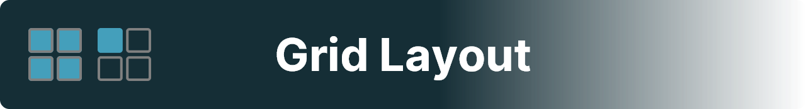
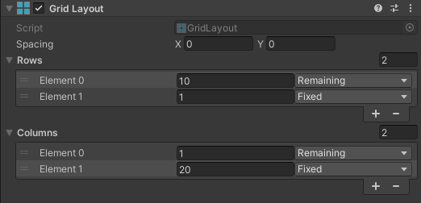
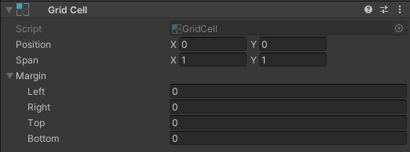
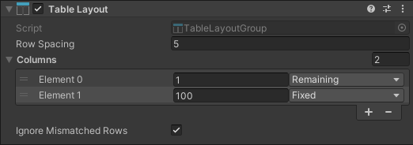
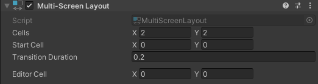

# Unity User Interface Utility
This package adds components and helper methods to make working with UI in Unity simpler and more flexible.

## Layout Components

The `GridLayout` component divides a `RectTransform`'s area into grid cells. Those can be used by `GridCell`s to reposition and resize themselves. \
`GridLayout`s must be used in combination with `GridCell`s to have an effect.

    

| | |
|-|-|
| `Spacing` | The horizontal and vertical spacing between grid cells. |
| `Rows` | The rows defined in the grid. |
| `Rows` > `Height` | The size of the row. |
| `Rows` > `Unit` | The unit of the row's height. Can be either `Fixed` or `Relative`. Relative rows will shared any space not taken up by fixed rows, using their height to calculate their respective share. |
| `Columns` | The columns defined in the grid. |
| `Columns` > `Width` | The size of the column. |
| `Rows` > `Unit` | The unit of the column's width. Can be either `Fixed` or `Relative`. Relative columns will shared any space not taken up by fixed columns, using their width to calculate their respective share. |

---

The `GridCell` component allows a `RectTransform` to automatically reposition and resize itself, based on the settings of a `GridLayout` component. \
The target `GridLayout` must be a direct parent of the `GridCell` object for the component to work.

    

| | |
|-|-|
| `Position` | The 0-based indices of the cell's associated (starting) row and column in the parent grid. |
| `Span` | The number of cells that the `GridCell` object spans horizontally and vertically. Cannot be less than 1 on either axis. |
| `Margin` | The distance to the edges of the cell. Note that too large values may cause a negative final size. |

\
\

The `TableLayoutGroup` can be used to automatically position children of a `RectTransform` in table columns.

    

| | |
|-|-|
| `Row Spacing` | The spacing between individual cell rows. |
| `Columns` | The columns defined in the table. |
| `Columns` > `Width` | The size of the column. |
| `Rows` > `Unit` | The unit of the column's width. Can be either `Fixed` or `Relative`. Relative columns will shared any space not taken up by fixed columns, using their width to calculate their respective share. |
| `Ignore Mismatched Rows` | If checked, any children that do not themselves contain a number of children equal to the number of columns in the table, will not be considered when calculating the layout. |

\
\

The `MultiScreenLayout` component acts like a full-screen layout group, with one child at once taking up the entire space of the parent `RectTransform` the component is attached to. \
It allows for both instant and smooth transitions between screen cells. Any children with a sibling index outside greater than the maximum number of screen cells will not be influenced by the `MultiScreenLayout`component.

    

| | |
|-|-|
| `Cells` | The horizontal and vertical number of cells. Cannot be less than 1, respectively. The product of both is the maximum number of cells. |
| `Start Cell` | The 0-based index of the initial screen cell. |
| `Transition Duration` | The duration in seconds that smooth transitions between two screen cells take. |
| `Editor Cell` | The screen cell that is active in the editor. This is for editing purposes only, and will not affect runtime behaviour. The property will not be included in builds either. |